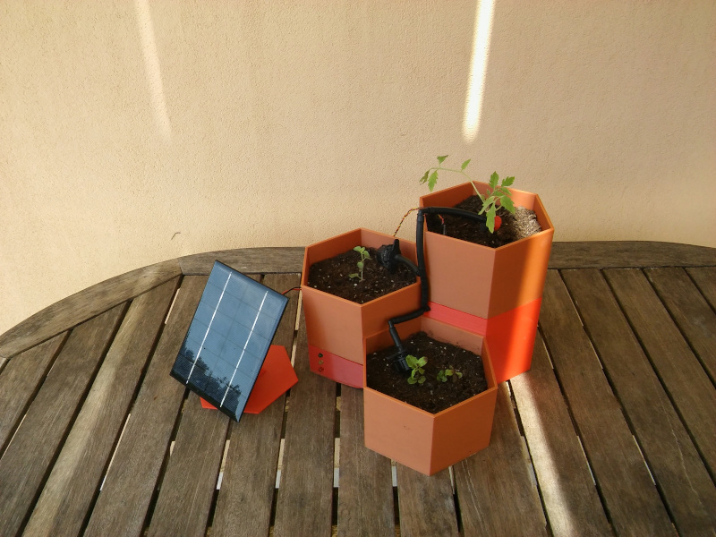
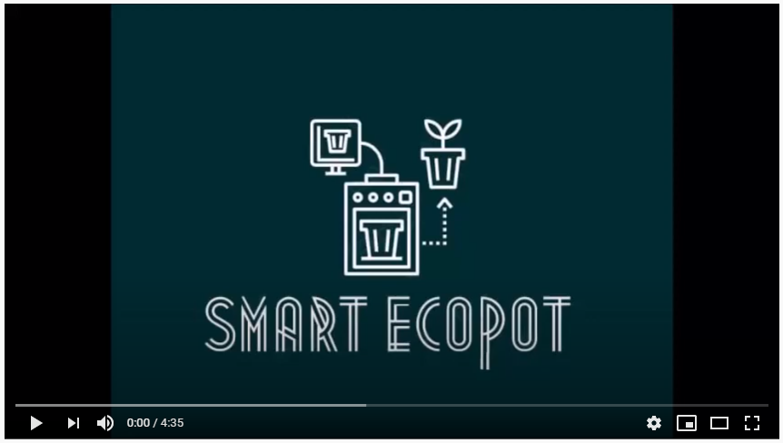
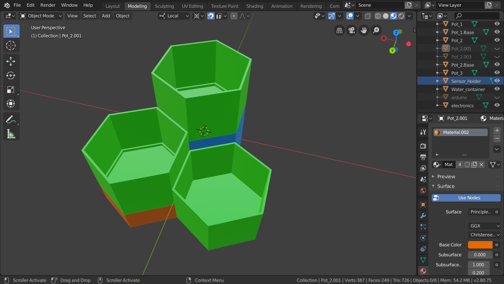
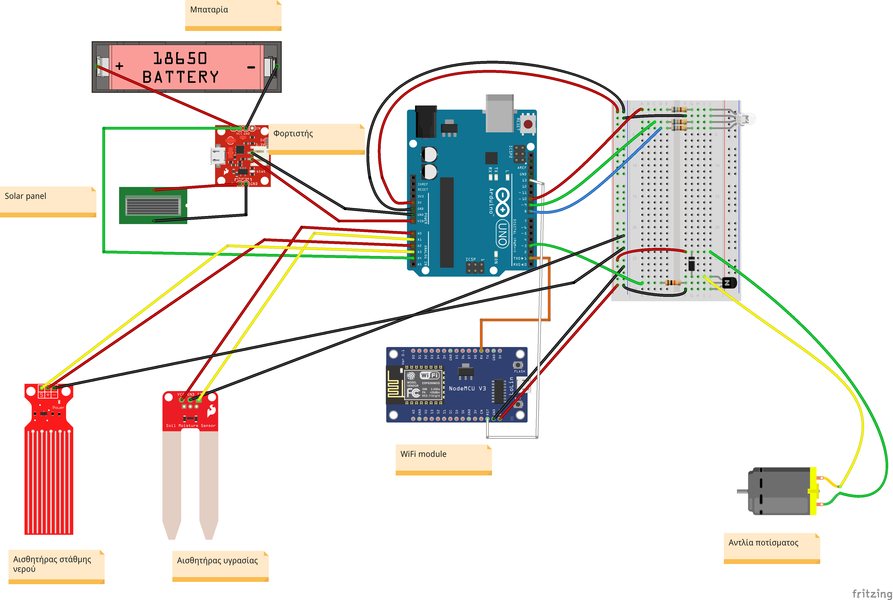

---
# Smart ecoPOT
 Έξυπνο σύστημα διαχείρισης ποτίσματος

- [Περιγραφή](#Περιγραφή)
- [Θεματική](#Θεματική)
- [Τεχνολογίες - υλοποίηση](#Τεχνολογίες-υλοποίηση)
- [Ομάδα έργου](#Ομάδα)
- [Οργάνωση του έργου](#Οργάνωση)
- [Προϋπολογισμός](#Προϋπολογισμός)
- [Σύνδεσμοι](#Σύνδεσμοι)

>## Περιγραφή
Το `Smart ecoPOT` είναι μία «έξυπνη» γλάστρα στην οποία το φυτό ποτίζεται αυτόματα σύμφωνα με τις ανάγκες του. Η συγκεκριμένη λύση βασίζεται σε μετρήσεις της υγρασίας του χώματος στη γλάστρα και όταν αυτή μειωθεί κάτω από ένα όριο ενεργοποιείται μία αντλία νερού και το φυτό ποτίζεται με την απαιτούμενη ποσότητα νερού.

Το προτεινόμενο σχέδιο γλάστρας αποτελείται από τρία μικρά γλαστράκια εξάγωνου σχήματος και διαφορετικών υψών στα οποία μπορούν να φυτευτούν διάφορα φυτά. Στην κατασκευή περιλαμβάνεται η δεξαμενή νερού και ένας χώρος στον οποίο μπαίνει το ηλεκτρονικό κύκλωμα για τον έλεγχο του ποτίσματος.

Με τον έλεγχο της υγρασίας του χώματος και της παροχής νερού, τα φυτά μπορούν να αναπτυχθούν πιο υγιή. Τόσο η έλλειψη νερού όσο και το υπερβολικό πότισμα μπορούν να προκαλέσουν την καταστροφή του φυτού, ιδιαίτερα όταν πρόκειται για ευαίσθητα στην πρόσληψη νερού μυρωδικά. Με το προτεινόμενο σχέδιο το φυτό προσλαμβάνει την ποσότητα νερού που χρειάζεται για την καλύτερη ανάπτυξή του ακριβώς όταν τη χρειάζεται.

Επιπλέον, δεν απαιτείται από τον ιδιοκτήτη του φυτού να θυμάται κάθε πότε πρέπει να το ποτίσει. Το φυτό είναι αυτόνομο και απαιτείται μόνο η πλήρωση της δεξαμενής με νερό όποτε χρειάζεται. Στην περίπτωση που το νερό στη δεξαμενή εξαντλείται θα ανάβει ένα κόκκινο φωτάκι έτσι ώστε να ενημερώνεται ο ιδιοκτήτης ότι πρέπει να τη γεμίσει. Ιδιαίτερα στα απαιτητικά αστικά περιβάλλοντα αυτό είναι μία ελάφρυνση από ένα καθημερινό καθήκον.

Ένα βασικό πλεονέκτημα της κατασκευής είναι ότι γίνεται εξοικονόμηση νερού. Χρησιμοποιείται μόνο όσο νερό χρειάζεται και στο χρόνο που χρειάζεται. Αυτό είναι ιδιαίτερα σημαντικό στην εφαρμογή σε μεγαλύτερη κλίμακα.

Η γλάστρα μπορεί εύκολα να εκτυπωθεί σε 3D εκτυπωτή με βάση το σχέδιο, σε διάφορα χρώματα και μεγέθη. Είναι σχεδιασμένη έτσι ώστε να συναρμολογείται εύκολα και να χωρίζεται σε κομμάτια για να γεμίσει η δεξαμενή νερού, να πλυθεί, να ανανεωθούν τα φυτά ή ακόμα να αλλαχτούν τα εξαρτήματα της κατασκευής.

Δείτε το βίντεο με την περιγραφή της κατασκευής μας.

Και μία  [παρουσίαση](./Docs/GLASTRA.pdf) που κάναμε διαδικτυακά.

>## Θεματική
Το συγκεκριμένο έργο εντάσσεται στη θεματική της αστικής κηπουρικής, η οποία αναφέρεται στην ανάπτυξη φυτών στις πόλεις και γύρω από αυτές. Η αστική κηπουρική αποτελεί μέρος του αστικού οικοσυστήματος και της οικονομίας των πόλεων. 

Η αστική κηπουρική συμβάλει στη βελτίωση της ποιότητας της τροφής που καταναλώνεται στα αστικά κέντρα και στην προώθηση πιο υγιεινής διατροφής. Συγχρόνως, μειώνει το κόστος ενός νοικοκυριού για διατροφή αλλά και το οικολογικό αποτύπωμα της καλλιέργειας (γη, νερό, καύσιμα από τη μεταφορά της τροφής).

Η συγκεκριμένη πρόταση θα μπορούσε να επεκταθεί και για τη διαχείριση μεγαλύτερων αγροτικών εκτάσεων. Η διαχείριση του ποτίσματος μίας καλλιέργειας με αυτόν τον τρόπο θα επέφερε μεγαλύτερη εξοικονόμηση νερού και υγιείς καλλιέργειες.

>## Τεχνολογίες-υλοποίηση
Αφορμή και κίνητρο για τη συμμετοχή μας στο διαγωνισμό, είναι η αξιοποίηση του αναβαθμισμένου εξοπλισμού που παρέλαβε το σχολείο μας την περσινή χρονιά. Σε αυτόν περιλαμβάνεται ένας 3D εκτυπωτής, ένα 3D scanner, 8 εκπαιδευτικά set `Arduino Uno` και 10 σταθμοί εργασίας με `Raspberry pi`.  
Για την απόκτηση τεχνογνωσίας σχετικά με τον εξοπλισμό αυτό αξιοποιήθηκαν αποκλειστικά πηγές από το διαδίκτυο και εθελοντές ειδικοί σε σχετικούς τομείς.

Για την εκτύπωση της γλάστρας χρησιμοποιήθηκε ο 3D εκτυπωτής του Εργαστηρίου Τεχνολογίας του σχολείου. Με την αξιοποίηση του 3D εκτυπωτή κατασκευάζεται μία ολοκληρωμένη διάταξη, με τη γλάστρα, τη δεξαμενή νερού και τα ηλεκτρονικά, προσαρμοσμένη στις απαιτήσεις του έργου. 

Το αρχικό σχέδιο της γλάστρας έγινε στο online ελεύθερο λογισμικό `Tinkercad`. Στη συνέχεια λόγω μεγαλύτερης ευελιξίας προτιμήθηκε το επίσης ελεύθερο λογισμικό `Blender`. 
Αρχικό σχέδιο κατασκευής στο `Tinkercad` 

 

Τελικό σχέδιο κατασκευής στο `Blender` 

 

Η κατασκευή αποτελείται από τρία κανονικά εξαγωνικά πρίσματα διαφορετικού ύψους, στο πάνω μέρος των οποίων έχουν προσαρτηθεί γλαστράκια ίδιου σχήματος και ύψους με το μικρότερο από τα πρίσματα. Τα γλαστράκια είναι αποσπώμενα έτσι ώστε να μπορούν να γεμίσουν με χώμα και να φυτευτούν. Το κάτω μέρος από το μεγαλύτερο από τα εξάγωνα είναι η δεξαμενή νερού και στο αντίστοιχο κάτω μέρος από το μεσαίο γλαστράκι μπαίνει το κύκλωμα με το Arduino. 

Για τον έλεγχο της στάθμης του νερού και της υγρασίας του χώματος χρησιμοποιείται `Arduino Uno`. Για τη μέτρηση της υγρασίας του χώματος χρησιμοποιείται αναλογικός αισθητήρας υγρασίας ο οποίος δίνει μία τιμή στο πρόγραμμα ανάλογα με την υγρασία του χώματος. Το πρόγραμμα μετατρέπει αυτή την τιμή σε ποσοστό %. Για τη μέτρηση της στάθμης νερού τοποθετηθηκε στη δεξαμενή ένας δεύτερος αισθητήρας υγρασίας που δίνει σήμα ανάλογα με τη στάθμη του νερού. Υπάρχει ακόμα μία αντλία ποτίσματος, η οποία συνδέεται μέσω κατάλληλης διάταξης για την ενίσχυση του ρεύματος, σε μία ψηφιακή έξοδο του Arduino. Το οριστικό σχηματικό διάγραμμα του κυκλώματος έγινε στο fritzing και είναι το παρακάτω:

 
 

Για την προβολή της κατάστασης του συστήματος υπάρχουν ενδεικτικά led τα οποία ειδοποιούν για την κατάσταση της υγρασίας του χώματος, την επάρκεια νερού στη δεξαμενή και την κατάσταση ποτίσματος. Το κύκλωμα τροφοδοτείται είτε από τροφοδοτικό είτε εναλλακτικά από επαναφορτιζόμενη μπαταρία με φωτοβολταϊκό πάνελ. Για τη στήριξη του φωτοβολταϊκού σχεδιάστηκε και τυπώθηκε στον 3D εκτυπωτή μία βάση.

Το λογισμικό για τον έλεγχο των αισθητήρων, της αντλίας και των ενδείξεων αναπτύχθηκε στην πλατφόρμα Arduino. Ένα βασικό διάγραμμα ροής του προγράμματος υπάρχει στον φάκελο [Docs](./Docs/flowchart_1.pdf)

Για την αναπαραγωγή του έργου δίνεται το σχέδιο της [γλάστρας](./3D/) για εκτύπωση σε 3D εκτυπωτή, το σχέδιο του [κυκλώματος](./Schematics/) και το [πρόγραμμα](./Source/)  .

Στην κατασκευή ενσωματώθηκε ένα WiFi module για τη βελτίωση της εποπτείας της κατάστασης. Μέσω αυτού στέλνονται τα δεδομένα της γλάστρας, όπως υγρασία χώματος και στάθμη νερού, στην πλατφόρμα ThingSpeak. Από εκεί υπάρχει η δυνατότητα παρακολούθησης της κατάστασης σε πραγματικό χρόνο μέσω μίας ιστοσελίδας.

>## Ομάδα
Στο έργο συμμετείχαν μαθητές της Β' τάξης του 1ου Γυμνασίου Ρόδου υπό την καθοδήγηση της καθηγήτριας τεχνολογίας Αγγελικής Νικολάου.
Οι συναντήσεις των μαθητών γινόντουσαν μετά το σχολικό ωράριο στο χώρο του σχολείου. Μετά το κλείσιμο των σχολείων λόγω κοροναϊού, οι συναντήσεις συνεχίστηκαν με το https://jitsi.org/jitsi-meet/.  Αν και όλοι οι μαθητές συνεργάστηκαν μεταξύ τους για το έργο, δημιουργήθηκαν κάποιες ομάδες οι οποίες ανέλαβαν ένα μέρος του. Συγκεκριμένα οι ομάδες είναι οι ακόλουθες:

    Προγραμματιστές
    Ασχολήθηκαν κυρίως με την ανάπτυξη του λογισμικού για το Arduino.
---
    Σχεδιαστές
    Σχεδίασαν τη γλάστρα για την εκτύπωση στον 3D εκτυπωτή. 
---
    Ηλεκτρονικοί
    Σχεδίασαν το κύκλωμα και συντόνισαν την υλοποίηση της κατασκευής.  

Φωτογραφίες της ομάδας επί το έργον, υπάρχουν στον φάκελο [Images/Act](./Images/Act).

> ## Οργάνωση
Ο τρόπος οργάνωσης και υλοποίησης καθώς και το πλαίσιο του έργου περιγράφεται αναλυτικά στο σχετικό [αρχείο](./Docs/ConceptOfProject.pdf).

> ## Προϋπολογισμός
Κόστος έργου για τη βασική κατασκευή:

Ειδος|Τιμή
---|---:
Arduino Nano OEM|4,50€
Βυθιζόμενη αντλία|5€
Σωληνάκι|0,60€
Transistor|0,05€
Αντιστάσεις|0,05€
Καλώδια|1€
LED|0,20€
Αισθητήρας στάθμης νερού|2€
Αισθητήρες υγρασίας εδάφους|2€
Breadboard|1€
PLA|6€
ΣΥΝΟΛΟ|22,40€

Κόστος έργου με επιλογή για τροφοδοτικό:

Ειδος|Τιμή
---|---:
Βασική κατασκευή|22,40€
Τροφοδοτικό|5€
ΣΥΝΟΛΟ|27,40€

Κόστος έργου με επιλογή για φωτοβολταϊκό και επαναφορτιζόμενη μπαταρία:

Ειδος|Τιμή
---|---:
Βασική κατασκευή|22,40€
Φωτοβολταϊκό πάνελ 5v, 1w|3€
Επαναφορτιζόμενη μπαταρία 18650 3400mAh|4,40€
Κύκλωμα φόρτισης φωτοβολταϊκού CN3065|3,80€
Κύκλωμα φόρτισης μπαταρίας 134N3P|1,20€
ΣΥΝΟΛΟ|34,80€

Το κόστος για την επέκταση της κατασκευής με το wifi module:

Ειδος|Τιμή
---|---:
NodeMCU|7€

> ## Σύνδεσμοι

2ος Πανελλήνιος Διαγωνισμός Ανοιχτών Τεχνολογιών στην Εκπαίδευση https://robotics.ellak.gr/

Arduino https://www.arduino.cc

3D printer Ultimaker 2+ https://ultimaker.com/3d-printers/ultimaker-2-plus 

Tinkercad https://www.tinkercad.com/

fritzing https://fritzing.org/

ThingSpeak https://thingspeak.com/

Blender https://www.blender.org/

Αστική κηπουρική https://www.ruaf.org/urban-agriculture-what-and-why

1ο Γυμνάσιο Ρόδου http://1gym-rodou.dod.sch.gr/wp/

---
