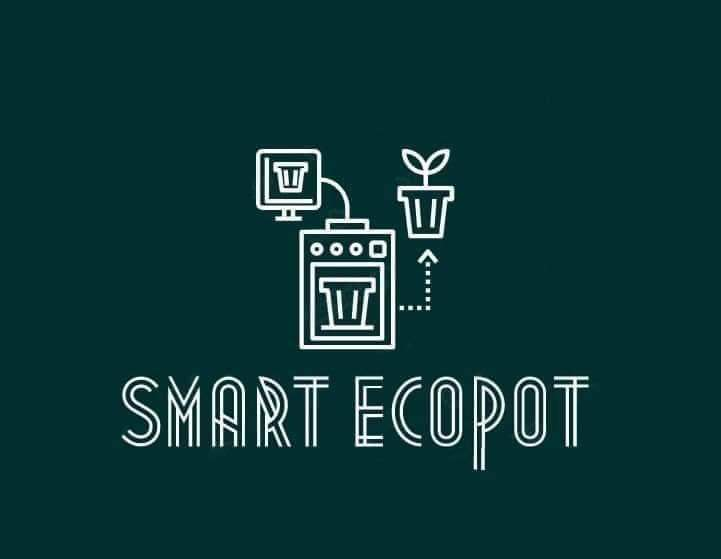
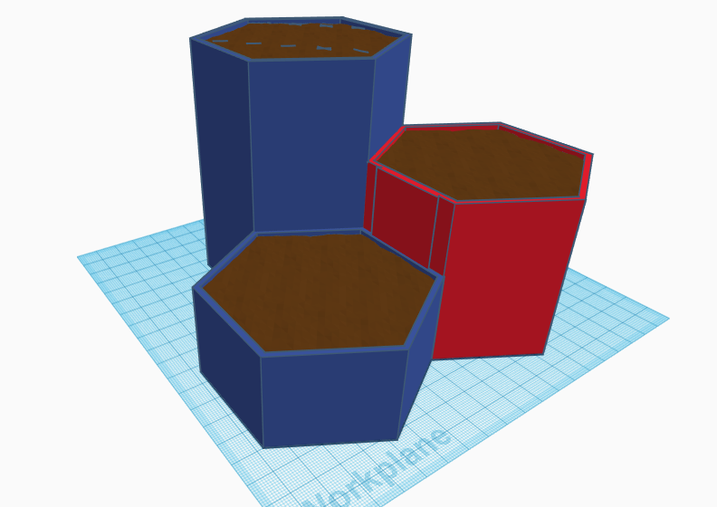
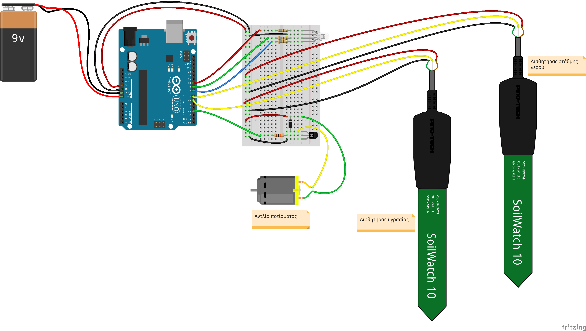

---
# Smart ecoPOT
 Έξυπνο σύστημα διαχείρισης ποτίσματος

- [Περιγραφή](#Περιγραφή)
- [Θεματική](#Θεματική)
- [Τεχνολογίες - υλοποίηση](#Τεχνολογίες-υλοποίηση)
- [Επεκτάσεις](#Επεκτάσεις)
- [Ομάδα έργου](#Ομάδα)
- [Προϋπολογισμός](#Προϋπολογισμός)
- [Σύνδεσμοι](#Σύνδεσμοι)

---
>## Περιγραφή
Το `Smart ecoPOT` είναι μία «έξυπνη» γλάστρα στην οποία το φυτό ποτίζεται αυτόματα σύμφωνα με τις ανάγκες του. Η συγκεκριμένη λύση βασίζεται σε μετρήσεις της υγρασίας του χώματος στη γλάστρα και όταν αυτή μειωθεί κάτω από ένα όριο ενεργοποιείται μία αντλία νερού και το φυτό ποτίζεται ώσπου η υγρασία να επανέλθει στα επιθυμητά επίπεδα.

Το προτεινόμενο σχέδιο γλάστρας αποτελείται από τρία μικρά γλαστράκια εξάγωνου σχήματος και διαφορετικών υψών στα οποία μπορούν να φυτευτούν διάφορα φυτά. Στην κατασκευή περιλαμβάνεται η δεξαμενή νερού και ένας χώρος στον οποίο μπαίνει το ηλεκτρονικό κύκλωμα για τον έλεγχο του ποτίσματος.

Με τον έλεγχο της υγρασίας του χώματος και της παροχής νερού, τα φυτά μπορούν να αναπτυχθούν πιο υγιή. Τόσο η έλλειψη νερού όσο και το υπερβολικό πότισμα μπορούν να προκαλέσουν την καταστροφή του φυτού, ιδιαίτερα όταν πρόκειται για ευαίσθητα στην πρόσληψη νερού μυρωδικά. Με το προτεινόμενο σχέδιο το φυτό προσλαμβάνει την ποσότητα νερού που χρειάζεται για την καλύτερη ανάπτυξή του ακριβώς όταν τη χρειάζεται.

Επιπλέον, δεν απαιτείται από τον ιδιοκτήτη του φυτού να θυμάται κάθε πότε πρέπει να το ποτίσει. Το φυτό είναι αυτόνομο και απαιτείται μόνο η πλήρωση της δεξαμενής με νερό όποτε χρειάζεται. Στην περίπτωση που το νερό στη δεξαμενή εξαντλείται θα ανάβει ένα κόκκινο φωτάκι έτσι ώστε να ενημερώνεται ο ιδιοκτήτης ότι πρέπει να τη γεμίσει. Ιδιαίτερα στα απαιτητικά αστικά περιβάλλοντα αυτό είναι μία ελάφρυνση από ένα καθημερινό καθήκον.

Ένα βασικό πλεονέκτημα της κατασκευής είναι ότι γίνεται εξοικονόμηση νερού. Χρησιμοποιείται μόνο όσο νερό χρειάζεται και στο χρόνο που χρειάζεται. Αυτό θα ήταν ιδιαίτερα σημαντικό στην εφαρμογή σε μεγαλύτερη κλίμακα.

Η γλάστρα μπορεί εύκολα να εκτυπωθεί σε 3D εκτυπωτή με βάση το σχέδιο, σε διάφορα χρώματα και μεγέθη. Είναι σχεδιασμένη έτσι ώστε να συναρμολογείται εύκολα και να χωρίζεται σε κομμάτια για να γεμίσει η δεξαμενή νερού, να πλυθεί, να ανανεωθούν τα φυτά ή ακόμα να αλλαχτούν τα εξαρτήματα της κατασκευής.

---
>## Θεματική
Το συγκεκριμένο έργο εντάσσεται στη θεματική της αστικής κηπουρικής, η οποία αναφέρεται στην ανάπτυξη φυτών στις πόλεις και γύρω από αυτές. Η αστική κηπουρική αποτελεί μέρος του αστικού οικοσυστήματος και της οικονομίας των πόλεων. 

Η αστική κηπουρική συμβάλει στη βελτίωση της ποιότητας της τροφής που καταναλώνεται στα αστικά κέντρα και στην προώθηση πιο υγιεινής διατροφής. Συγχρόνως, μειώνει το κόστος ενός νοικοκυριού για διατροφή αλλά και το οικολογικό αποτύπωμα της καλλιέργειας (γη, νερό, καύσιμα από τη μεταφορά της τροφής).

Η συγκεκριμένη πρόταση θα μπορούσε να επεκταθεί και για τη διαχείριση μεγαλύτερων αγροτικών εκτάσεων. Η διαχείριση του ποτίσματος μίας καλλιέργειας με αυτόν τον τρόπο θα επέφερε μεγαλύτερη εξοικονόμηση νερού και υγιείς καλλιέργειες.

---
>## Τεχνολογίες-υλοποίηση
Αφορμή και κίνητρο για τη συμμετοχή μας στο διαγωνισμό, είναι η αξιοποίηση του αναβαθμισμένου εξοπλισμού που παρέλαβε το σχολείο μας την περσινή χρονιά. Σε αυτόν περιλαμβάνεται ένας 3D εκτυπωτής, ένα 3D scanner, 8 εκπαιδευτικά set `Arduino Uno` και 10 σταθμοί εργασίας με `Raspberry pi`.  
Για την απόκτηση τεχνογνωσίας σχετικά με τον εξοπλισμό αυτό αξιοποιήθηκαν αποκλειστικά πηγές από το διαδίκτυο και εθελοντές ειδικοί σε σχετικούς τομείς.

Για την εκτύπωση της γλάστρας θα χρησιμοποιηθεί ο 3D εκτυπωτής του εργαστηρίου τεχνολογίας του σχολείου. Για το σχέδιο της γλάστρας θα χρησιμοποιηθεί το online ελεύθερο λογισμικό `Tinkercad`. Με την αξιοποίηση του 3D εκτυπωτή κατασκευάζεται μία ολοκληρωμένη διάταξη με τη γλάστρα, τη δεξαμενή νερού και τα ηλεκτρονικά προσαρμοσμένη στις απαιτήσεις του έργου. Το ενδεικτικό σχέδιο φαίνεται παρακάτω:

 

Για τον έλεγχο της στάθμης του νερού και της υγρασίας του χώματος χρησιμοποιείται `Arduino Uno`. Στην τελική κατασκευή, για λόγους εξοικονόμησης χώρου, θα αντικατασταθεί με το `Arduino Nano`. Για τη μέτρηση της υγρασίας του χώματος θα χρησιμοποιηθεί αισθητήρας υγρασίας ο οποίος μετά από ρύθμιση στο λογισμικό θα δίνει την υγρασία σε ποσοστό %. Για τη μέτρηση της στάθμης νερού θα τοποθετηθεί στη δεξαμενή ένας δεύτερος αισθητήρας υγρασίας που θα δίνει το κατάλληλο σήμα όταν η στάθμη φτάσει στο κατώτατο επίπεδο. Θα υπάρχει ακόμα μία αντλία ποτίσματος, η οποία θα συνδέεται μέσω κατάλληλης διάταξης για την ενίσχυση του ρεύματος σε μία ψηφιακή έξοδο του Arduino. Το σχηματικό διάγραμμα του κυκλώματος είναι το παρακάτω:

 
 

Για την προβολή της κατάστασης του συστήματος θα υπάρχουν ενδεικτικά led τα οποία θα ειδοποιούν για τα επίπεδα της υγρασίας στο χώμα, τη στάθμη του νερού στη δεξαμενή και την κατάσταση ποτίσματος. Το κύκλωμα θα τροφοδοτείται είτε από τροφοδοτικό είτε εναλλακτικά από επαναφορτιζόμενη μπαταρία με φωτοβολταϊκό πάνελ. 

Το λογισμικό για τον έλεγχο των αισθητήρων, της αντλίας και των ενδείξεων θα αναπτυχθεί στην πλατφόρμα Arduino. Ένα αρχικό διάγραμμα ροής του προγράμματος υπάρχει στον φάκελο [Docs](./Docs/flowchart_1.pdf)

Το έργο θα μπορεί να αναπαραχθεί με βάση τις οδηγίες. Θα δίνεται το σχέδιο της γλάστρας για εκτύπωση σε 3D εκτυπωτή, το σχέδιο του κυκλώματος και το πρόγραμμα.

---
>## Επεκτάσεις
Εξετάζεται η δυνατότητα επέκτασης του έργου με την ενσωμάτωση ενός WiFi module για τη βελτίωση της εποπτείας της κατάστασης. Μέσω αυτού θα μπορούσαν να στέλνονται ειδοποιήσεις μέσω email και να λειτουργεί μία ιστοσελίδα με πληροφορίες για την κατάσταση του συστήματος. 

---
>## Ομάδα
Στο έργο συμμετέχουν μαθητές της Β’ τάξης του 1ου Γυμνασίου Ρόδου υπό την καθοδήγηση της καθηγήτριας Αγγελικής Νικολάου.
Οι συναντήσεις των μαθητών γίνονται μετά το σχολικό ωράριο στο χώρο του σχολείου. Αν και όλοι οι μαθητές συνεργάζονται μεταξύ τους για το έργο, έχουν δημιουργηθεί κάποιες ομάδες οι οποίες έχουν αναλάβει ένα μέρος του. Συγκεκριμένα οι ομάδες είναι οι ακόλουθες:

    Προγραμματιστές
    Ασχολούνται κυρίως με την ανάπτυξη του λογισμικού για το Arduino.
---
    Σχεδιαστές
    Έχουν αναλάβει τη σχεδίαση της γλάστρας για την εκτύπωση στον 3D εκτυπωτή. 
---
    Ηλεκτρονικοί
    Σχεδιάζουν το κύκλωμα και συντονίζουν την υλοποίηση της κατασκευής.  

Φωτογραφίες της ομάδας επί το έργο, υπάρχουν στον φάκελο [Images/Act](./Images/Act).

---
> ## Προϋπολογισμός
Κόστος έργου για τη βασική κατασκευή:

Ειδος|Τιμή
---|---:
Arduino Nano OEM|4,50€
Βυθιζόμενη αντλία|5€
Σωληνάκι|0,60€
Transistor|0,05€
Αντιστάσεις|0,05€
Καλώδια|1€
LED|0,20€
Αισθητήρας στάθμης νερού|2€
Αισθητήρες υγρασίας εδάφους|2€
Breadboard|1€
PLA|6€
ΣΥΝΟΛΟ|22,40€

Κόστος έργου με επιλογή για τροφοδοτικό:

Ειδος|Τιμή
---|---:
Βασική κατασκευή|22,40€
Τροφοδοτικό|5€
ΣΥΝΟΛΟ|27,40€

Κόστος έργου με επιλογή για φωτοβολταϊκό και επαναφορτιζόμενη μπαταρία:

Ειδος|Τιμή
---|---:
Βασική κατασκευή|22,40€
Φωτοβολταϊκό πάνελ 5v, 1w|3€
Επαναφορτιζόμενη μπαταρία 18650 3400mAh|4,40€
Κύκλωμα φόρτισης φωτοβολταϊκού CN3065|3,80€
Κύκλωμα φόρτισης μπαταρίας 134N3P|1,20€
ΣΥΝΟΛΟ|34,80€

Το κόστος για την επέκταση της κατασκευής με το wifi module:

Ειδος|Τιμή
---|---:
NodeMCU|7€

---

> ## Σύνδεσμοι

2ος Πανελλήνιος Διαγωνισμός Ανοιχτών Τεχνολογιών στην Εκπαίδευση https://robotics.ellak.gr/

Arduino https://www.arduino.cc

3D printer Ultimaker 2+ https://ultimaker.com/3d-printers/ultimaker-2-plus 

Tinkercad https://www.tinkercad.com/

Αστική κηπουρική https://www.ruaf.org/urban-agriculture-what-and-why

1ο Γυμνάσιο Ρόδου http://1gym-rodou.dod.sch.gr/wp/

---
